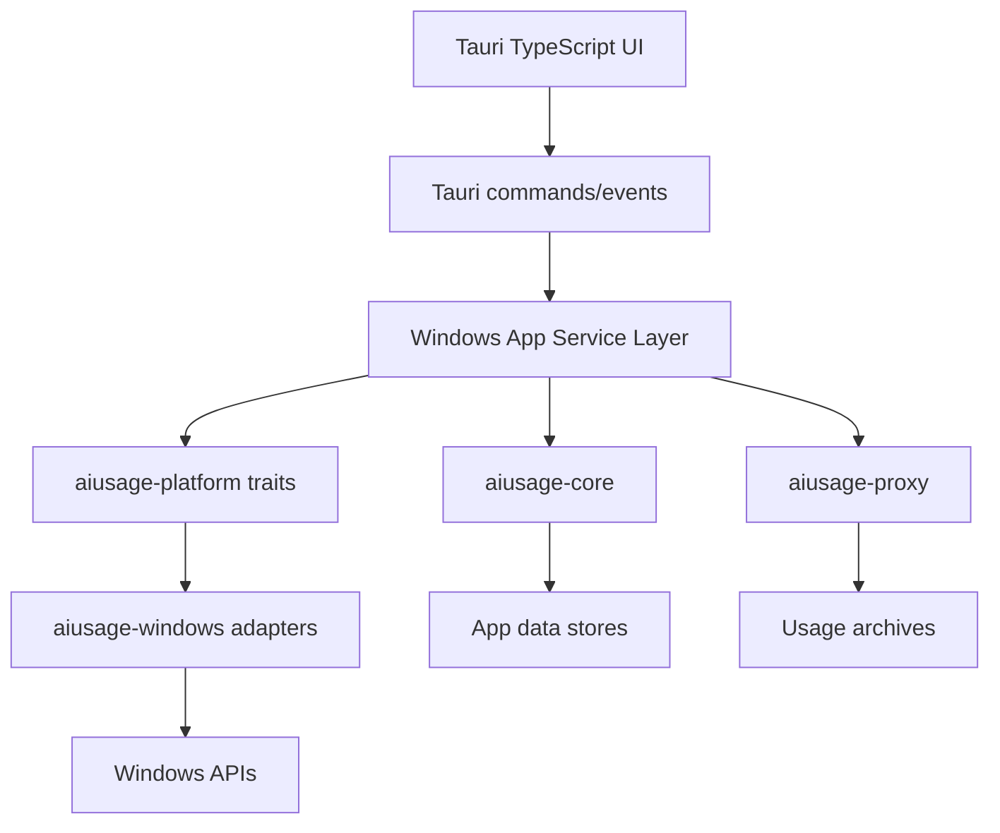

# Windows Porting Architecture

This document proposes the product architecture for a full Windows adaptation of AIUsage.

## Decision Summary

Build a new Windows desktop product line using **Tauri 2 + Rust + TypeScript UI**, while preserving the existing macOS SwiftUI application. The Windows implementation should reach feature parity through shared behavioral contracts, test fixtures, and a platform adapter architecture.

The Windows app must support the same major product surfaces: subscription monitoring, API providers, Claude Code proxy, Codex proxy, OpenCode proxy, global proxy, usage stats, call analytics, tray operation, secure credentials, installer, auto-update, and release automation.

## Repository Layout

Recommended additions:

```text
AIUsage/
├── AIUsage/                      # existing macOS SwiftUI app
├── QuotaBackend/                 # existing Swift package
├── Windows/
│   ├── README.md
│   ├── package.json
│   ├── pnpm-lock.yaml
│   ├── src/                      # TypeScript UI
│   ├── src-tauri/
│   │   ├── tauri.conf.json
│   │   ├── Cargo.toml
│   │   ├── icons/
│   │   └── src/
│   └── crates/
│       ├── aiusage-core/         # provider models, normalizers, config transforms
│       ├── aiusage-proxy/        # local Claude/Codex/OpenCode proxy runtime
│       ├── aiusage-platform/     # traits for platform-specific capabilities
│       ├── aiusage-windows/      # Windows implementations via windows-rs
│       ├── aiusage-tauri/        # Tauri command/event layer
│       └── aiusage-fixtures/     # parity fixture loader and contract tests
├── docs/
└── scripts/
```

The existing macOS implementation should not be forced into this layout. The Windows tree can mature independently, then shared schemas/fixtures can be promoted into common locations when stable.

## Runtime Layers



## Core Crates

### `aiusage-core`

Responsibilities:

- Provider IDs, display metadata, account models, quota summaries.
- Usage normalization for all supported providers.
- Proxy node models, model pricing, currency conversion, usage archive schema.
- Codex/OpenCode/Claude config transformation logic.
- JSONC/TOML-safe merge logic with backup-as-source-of-truth semantics.
- Call analytics models and aggregation.
- Language-neutral serialization compatible with macOS fixtures.

### `aiusage-proxy`

Responsibilities:

- Local HTTP proxy listeners for Claude Code, Codex, OpenCode, and global proxy tracks.
- SSE/streaming pass-through and conversion.
- OpenAI Responses, Chat Completions, Anthropic message API, and passthrough modes.
- Request/response accounting and frozen-cost usage archive writes.
- Local `/health` and admin endpoints.
- TLS listener support for local HTTPS.

Implementation notes:

- Use async Rust runtime.
- Use a structured event channel rather than parsing stdout lines for app-to-proxy communication.
- Keep a CLI/sidecar mode for debugging and for future headless use.

### `aiusage-platform`

Defines traits:

```text
CredentialVault
ProtectedData
AppPaths
ExternalCommandResolver
BrowserSessionDiscovery
ProcessInspector
PortInspector
SystemProxyReader
CertificateAuthorityInstaller
AutostartManager
NotificationManager
ShellOpener
FilePermissionGuard
```

### `aiusage-windows`

Windows implementations:

- Credentials: Credential Manager item for the vault, plus DPAPI for local encrypted payloads.
- Paths: `%APPDATA%\AIUsage` for durable user configuration; `%LOCALAPPDATA%\AIUsage` for logs, cache, helper state, TLS material, and transient data.
- Browser sessions: Chrome, Edge, Brave, Cursor, and other Chromium profile discovery under Windows user data paths.
- Cookie decryption: DPAPI unwrap for Chromium local state key, AES-GCM cookie value decrypt.
- Process/ports: Windows process APIs and IP Helper TCP tables.
- Proxy settings: WinHTTP/WinINET current user proxy read.
- Certificates: user or local-machine certificate store installation flow with clear elevation behavior.
- Autostart: current-user HKCU Run registry adapter is implemented; tray lifecycle remains in the Tauri desktop shell and consumes persisted app settings.

The Tauri command layer exposes a non-secret platform environment snapshot built from these adapters: app/CLI paths, system proxy endpoints, and browser profile metadata. Browser rows identify candidate cookie databases for future provider login flows but do not decrypt or read cookie values.

## Desktop Shell

### Tauri App Responsibilities

- Main window and route shell.
- Tray icon, tray status labels, context menu, and background behavior. The current shell uses Tauri tray-icon support for Show AIUsage, Open Settings, Quit AIUsage, click-to-restore, settings-driven close-to-tray, and explicit quit bypass.
- Tauri commands/events for provider refresh, proxy activation, config editing, platform environment status, diagnostics export, and update checks.
- WebView2-based UI rendering.
- Installer/updater integration.

### UI Responsibilities

The Windows UI should match the macOS information architecture:

- Dashboard
- Subscriptions
- API Providers
- Codex Proxy
- OpenCode Proxy
- Claude Code Proxy
- Usage Stats
- Call Analytics
- Inbox
- Settings

The UI may be implemented in React/TypeScript, but the state machine should mirror the product concepts rather than copy SwiftUI implementation details one-to-one.

## Data Paths

| Data | Windows location |
| --- | --- |
| App preferences | `%APPDATA%\AIUsage\settings.json` |
| Provider account registry | Credential vault auxiliary blob, with non-secret mirror under `%APPDATA%` only if needed for recovery |
| Secrets/API keys/cookies/tokens | Windows Credential Manager / DPAPI-protected vault |
| Node profiles | `%APPDATA%\AIUsage\profiles\*.json` |
| API provider configs | `%APPDATA%\AIUsage\api-providers.json` with secrets stripped or referenced |
| Usage archives | `%APPDATA%\AIUsage\usage-archive\*.json` |
| Proxy logs | `%LOCALAPPDATA%\AIUsage\proxy-logs\*.json` |
| Caches | `%LOCALAPPDATA%\AIUsage\cache\*` |
| Diagnostics exports | `%LOCALAPPDATA%\AIUsage\diagnostics\aiusage-diagnostics-*.json` |
| TLS CA/key material | `%LOCALAPPDATA%\AIUsage\tls\*`, DPAPI-protected where appropriate |
| Codex config | Native target: `%USERPROFILE%\.codex\config.toml`; alternate `CODEX_HOME` supported |
| Codex call sessions | `%USERPROFILE%\.codex\sessions\**\*.json[l]` and `%USERPROFILE%\.codex\archived_sessions\**\*.json[l]` |
| Claude Code config | Native target: `%USERPROFILE%\.claude\settings.json`; WSL target opt-in |
| Claude Call Analytics config/session inventory | `%USERPROFILE%\.claude.json`, `%USERPROFILE%\.claude\settings.json`, and `%USERPROFILE%\.claude\projects\**\*.jsonl` |
| OpenCode config | Native Windows location if defined by upstream; fallback `%USERPROFILE%\.config\opencode\opencode.json[c]`; explicit override supported |
| OpenCode call database inventory | `%LOCALAPPDATA%\opencode\opencode.db`, `%USERPROFILE%\.local\share\opencode\opencode.db`, `$XDG_DATA_HOME\opencode\opencode.db`, plus config-dir fallback |

The Windows Call Analytics service emits the same core snapshot shape as the macOS engine: installed Skill/MCP inventory plus day/source/kind/name aggregated call entries. Claude and Codex read JSONL files directly; OpenCode copies `opencode.db` plus WAL/SHM sidecars to a temporary read-only SQLite snapshot before querying tool parts.

The diagnostics export is intentionally metadata-only in the current Windows shell. It records path existence, file counts, byte totals, recent file metadata, and scan warnings, but does not include raw log bodies, CLI config bodies, credential values, cookies, or tokens.

## Config Takeover Semantics

Windows must preserve the current safety model:

- Backup before activation.
- Backup is the source of truth during the managed state.
- Restore writes the original file back verbatim when possible.
- Managed blocks have explicit sentinels.
- Permissions/secrets are handled using Windows security primitives, not POSIX `0600` assumptions.
- WSL and native Windows configs are separate targets.

## Credential Vault Design

Maintain the current "single canonical vault item" concept:

- One Windows Credential Manager target, for example `com.aiusage.desktop.providerCredentials`.
- Vault JSON stores credentials plus auxiliary blobs.
- Secrets can be additionally DPAPI-protected before storage if the credential backend cannot enforce the required behavior.
- Migration/import logic should be explicit. macOS Keychain cannot be read on Windows, so cross-OS migration should use an encrypted export/import flow.

## Proxy Process Model

Preferred Windows design:

- The proxy runtime is an in-process Rust service for normal Tauri operation.
- A sidecar/CLI binary remains available for isolation, crash diagnostics, and future service/headless operation.
- The app supervises all active proxy tracks through a common `ProxySupervisor`.
- Port conflicts are reported with owning process details where possible.
- Only AIUsage-owned proxy processes are stopped automatically.

## Update And Release Architecture

Windows release artifacts:

- `AIUsage-<version>-windows-x64-setup.exe` (NSIS, primary consumer installer).
- `AIUsage-<version>-windows-x64.msi` (enterprise/admin distribution).
- Optional `arm64` equivalents after x64 parity is stable.
- Signed update metadata for Tauri updater.
- GitHub Release upload alongside macOS artifacts.

Signing:

- Use SignTool in CI.
- Timestamp all signed artifacts.
- Store signing material through GitHub Actions secrets or a cloud signing service.

## Testing Architecture

Contract tests are required because two implementations will coexist.

| Test type | Purpose |
| --- | --- |
| Fixture parity tests | Same provider inputs produce equivalent normalized summaries on macOS Swift and Windows Rust |
| Config transform tests | Codex/OpenCode/Claude activation and restoration preserve user files |
| Proxy protocol tests | Streaming, passthrough, conversion, errors, and accounting match expected wire behavior |
| Platform adapter tests | Credential vault, DPAPI, process/port lookup, proxy settings, cert installation |
| UI E2E tests | Refresh, add account, activate proxy, tray behavior, settings persistence |
| Installer tests | Fresh install, upgrade, uninstall, auto-update, signed binary verification |

## Key Risks

| Risk | Mitigation |
| --- | --- |
| Logic drift between Swift and Rust | Shared fixtures, schema snapshots, contract tests, release gate |
| Browser cookie decryption differences | Isolated provider adapters with synthetic profile fixtures and manual browser matrix |
| WSL/native config confusion | Explicit target selection, never silently write WSL files |
| Certificate trust friction | Clear UI flow, user-level trust path first, admin path only when required |
| Windows Defender/network prompts | Sign binaries, stable install path, clear local-only firewall behavior |
| Provider-specific unknowns | Per-provider design notes and feature gates, not silent partial behavior |

## Architecture Definition Of Done

Windows architecture is complete when:

- Every macOS platform dependency has a named Windows adapter or an explicit replacement design.
- Every primary product screen has a Windows route and state owner.
- Every provider has a parity status and test plan.
- Installer, updater, signing, and CI are part of the plan from the start.
- No secret-bearing file is written without a Windows-specific security decision.
